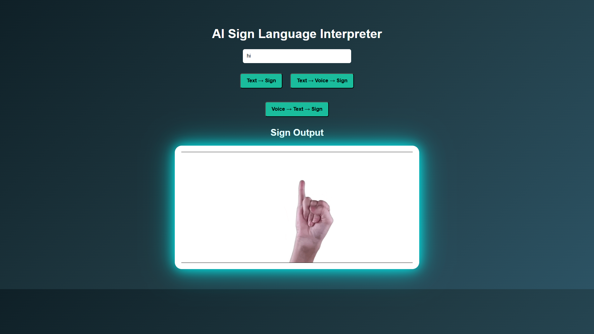
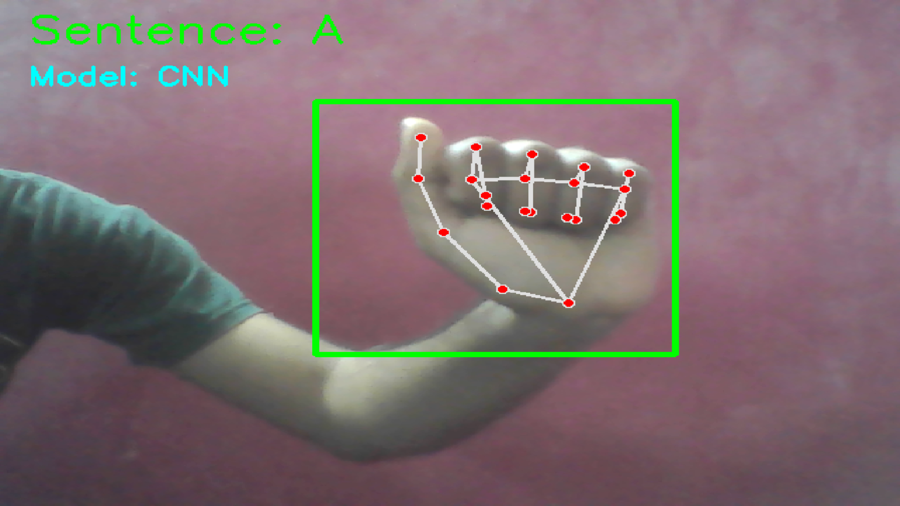

# AI Sign Language Interpreter

## Project Overview

AI Sign Language Interpreter is an AI-powered accessibility application developed as a Bachelor of Engineering (B.E.) Computer Science and Engineering Final Year Project.

The system bridges the communication gap between sign language users and non-sign-language users through real-time gesture recognition, text conversion, speech generation, and sign language visualization.

The application supports multiple communication modes:

* Sign → Text
* Sign → Speech
* Text → Sign
* Text → Speech → Sign
* Voice → Text → Sign

By combining Computer Vision, Deep Learning, Speech Processing, and Web Technologies, the project aims to improve accessibility and communication for individuals with hearing and speech impairments.

---

## Features

* Real-time hand gesture recognition using webcam input
* CNN-based image classification for sign recognition
* MediaPipe hand landmark detection
* MLP-based landmark classification
* Text-to-Sign conversion using animated sign representations
* Voice-to-Text conversion using speech recognition
* Text-to-Speech generation
* Interactive web-based user interface
* Multi-mode communication support
* Accessibility-focused design

---

## Technology Stack

### Programming Languages

* Python
* JavaScript
* HTML
* CSS

### Machine Learning & AI

* TensorFlow
* CNN (Convolutional Neural Networks)
* MLP (Multi-Layer Perceptron)

### Computer Vision

* OpenCV
* MediaPipe

### Backend

* Flask
* Flask-CORS

### Speech Processing

* SpeechRecognition
* pyttsx3

### Data Processing

* NumPy
* Scikit-Learn

---

## System Architecture

Input Layer

```
Sign Language Gesture
Text Input
Voice Input
```

Processing Layer

```
CNN Model
MLP Model
MediaPipe Landmark Detection
Speech Recognition
Text Processing
```

Output Layer

```
Text Output
Speech Output
Sign Animation Output
```

---

## Project Workflow

### Sign → Text / Speech

1. Capture hand gesture through webcam.
2. Detect hand landmarks using MediaPipe.
3. Extract landmark coordinates.
4. Classify gesture using CNN and MLP models.
5. Convert recognized gesture into text.
6. Generate speech output.

### Text → Sign

1. User enters text.
2. Text is processed and mapped to sign animations.
3. Corresponding sign GIFs are displayed.

### Voice → Text → Sign

1. User speaks through microphone.
2. Speech Recognition converts audio into text.
3. Text is processed.
4. Corresponding sign animations are displayed.

---

## Project Screenshots

### User Interface



### Real-Time Gesture Recognition



---

## Team Members

### Daniel J

* Backend Development
* Machine Learning Model Development
* Computer Vision Implementation
* System Integration

### Amit Kumar A

* Frontend Development
* User Interface Design
* Testing

### Aravind S

* Dataset Preparation
* Documentation
* Validation and Testing

---

## Applications

* Accessibility Solutions
* Assistive Technology
* Sign Language Translation
* Educational Platforms
* Human-Computer Interaction
* Inclusive Communication Systems

---

## Future Enhancements

* Indian Sign Language (ISL) support
* Sentence-level sign recognition
* Mobile application deployment
* Cloud deployment
* Real-time video translation
* Multi-language support
* Transformer-based gesture recognition
* Enhanced gesture dataset

---

## Academic Information

**Project Type:** Final Year Project

**Degree:** Bachelor of Engineering (B.E.)

**Department:** Computer Science and Engineering

**Institution:** Loyola Institute of Technology

---

## License

This project is developed for educational and research purposes.
